# C Pointers Notes

這個 repository 是針對 [Pointers in C/C++ (YouTube)](https://www.youtube.com/watch?v=zuegQmMdy8M) 影片所做的學習筆記。

---

## 目錄
- [1. Call by Reference](#1-call-by-reference)
  - [記憶體區塊](#記憶體區塊)
  - [傳址呼叫 (Call by Address)](#傳址呼叫-call-by-address)
  - [傳值呼叫 (Call by Value)](#傳值呼叫-call-by-value)
- [2. Pointers and Arrays](#2-pointers-and-arrays)
- [3. Array as function argument](#3-array-as-functions-argument)
- [4. Character arrays and pointers - part 1](#4-character-arrays-and-pointers-part1)
  - [字串基本概念](#字串基本概念)
  - [字串與指標](#字串與指標)
  - [用字元指標將字串傳入函式](#用字元指標將字串傳入函式)
- [5. Character arrays and pointers - part 2](#5-character-arrays-and-pointers-part2)
  - [記憶體與Stack解析 ](#記憶體與Stack解析) 
  - [唯讀記憶體 (Read-Only Data Segment)](#唯讀記憶體-read-only-data-segment)
- [6. Pointers and 2-D arrays](#6-Pointers-and-2-D-arrays)
  - [2D 指標陣列的使用](#2d-指標陣列的使用) 
  - [2維陣列的存取等價式](#二維陣列的存取等價式)
- [7. Pointers and multidimensional arrays](#7-Pointers-and-multidimensional-arrays)
  - [陣列傳入函式的型態規則](#陣列傳入函式的型態規則) 
  - [三維陣列的存取等價式](#三維陣列的存取等價式) 
- [8. Pointers and dynamic memory - stack vs heap](#8-Pointers-and-dynamic-memory-stack-vs-heap) 
  - [C 函式執行與記憶體配置](#c-函式執行與記憶體配置)
  - [Stack Overflow 是什麼？](#stack-overflow-是什麼)
  - [Heap 是什麼？該如何使用它？](#heap-是什麼-該如何使用它)
  - [malloc 的記憶體配置動態與圖解](#malloc-的記憶體配置動態與圖解)
- [9. Dynamic memory allocation in C - malloc calloc realloc free](#9-Dynamic-memory-allocation-in-C-malloc-calloc-realloc-free)
  - [malloc (Memory Allocation)](#malloc-memory-allocation)
  - [calloc (Contiguous Allocation)](#calloc-contiguous-allocation)
  - [realloc (Reallocate Memory)](#realloc-reallocate-memory)
- [10. Pointers as Function Returns in C/C++](#10-pointers-as-function-returns-in-cc)
  - [使用 malloc 與 free 後的指標行為說明](#使用-malloc-與-free-後的指標行為說明)
  - [使用 realloc 調整記憶體大小的行為說明](#使用-realloc-調整記憶體大小的行為說明)
  - [Heap 與 Stack 回傳指標的差異](#heap-與-stack-回傳指標的差異)
- [11. Function Pointers in C / C++](#11-function-pointers-in-c--c)
  - [function pointer原理解釋](#function-pointer原理解釋)
  - [function pointer實例操作](#function-pointer實例操作)
- [12. Function Pointers and Callbacks](#12-function-pointers-and-callbacks)
  - [function pointer 基本範例](#function-pointer-基本範例)
  - [BubbleSort by Callback](#BubbleSort-by-Callback)
  - [延伸應用：多種排序邏輯](#延伸應用多種排序邏輯)
  - [QuickSort by Callback](#QuickSort-by-Callback)

- [13. Memory Leak in C/C++](#13-memory-leak-in-cc)


---

## 1. Call by Reference
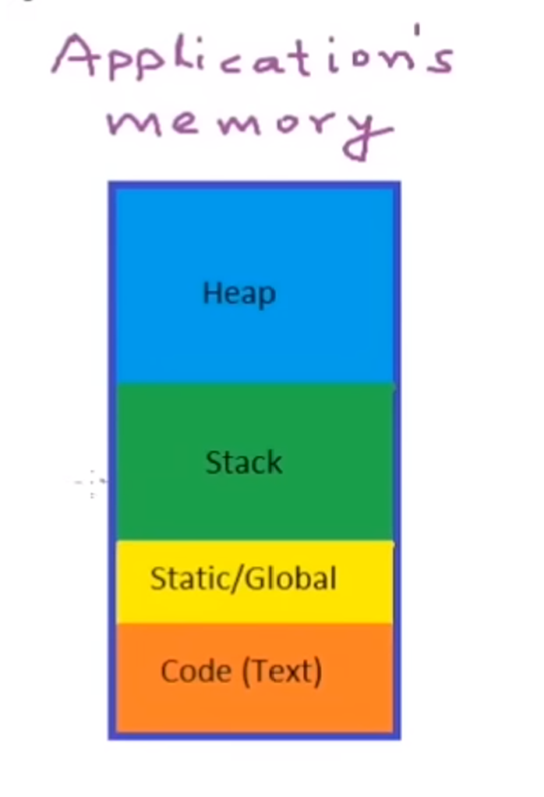

### 記憶體區塊
1. **Heap (堆積區)**
   >用於動態記憶體配置（例如 `malloc`、`calloc`）。

   >由程式設計師手動分配與釋放，否則可能造成記憶體洩漏。

   >適合儲存大小未知或執行期間才決定的資料。

2. **Stack (堆疊區)**
   >儲存函式的區域變數與參數。

   >每次呼叫函式時，系統會建立一個新的「堆疊框架 (stack frame)」。

   >當函式結束時，該堆疊框架會被釋放，記憶體自動回收。

3. **Static / Global (靜態/全域區)**
   >儲存全域變數、靜態變數 (static)。

   >這些變數在程式執行期間全程存在，直到程式結束才被釋放。

4. **Code (Text) 區**
   >儲存程式的機器碼指令。

   >通常為唯讀，避免程式被意外修改。

---

### 傳址呼叫 (Call by Address)
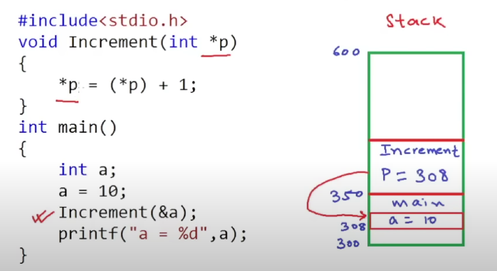

[查看程式碼 ➜](1.callByReference/callByAddress.c)

---

### 傳值呼叫 (Call by Value)
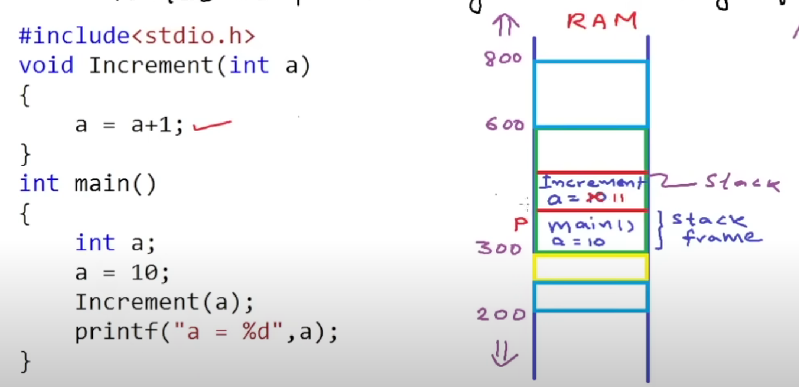

[查看程式碼 ➜](1.callByReference/callByValue.c)

---

## 2. Pointers and Arrays
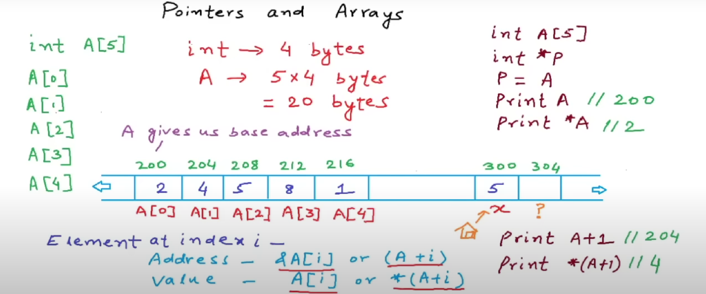

[查看程式碼 ➜](2.pointerAndArray/pointer-and-array.c)

---

### 陣列記憶體配置
```c
// int → 4 bytes
// int A[5] → 5 × 4 bytes = 20 bytes
// A 代表陣列的基底位址 (base address)
int A[5];
int *P;
P = A; // P 指向陣列 A 的基底位址

printf("%d\n", A);       // 印出 A (位址，例如 200)
printf("%d\n", *A);      // 印出 *A (A[0] 的值，例如 2)
printf("%d\n", A+1);     // A+1 → 下一個元素的位址 (例如 204)
printf("%d\n", *(A+1));  // *(A+1) → A[1] 的值 (例如 4)
```
### 元素存取方式
- **位址 (Address)** → `&A[i]` 或 `(A + i)`  
- **值 (Value)** → `A[i]` 或 `*(A + i)`

---

## 3. Array as Functions Argument

### ❌ 錯誤寫法
[查看程式碼 ➜](3.arrayAsFunctionArgument/wrong-array-in-functions.c)

⚠️ 錯誤原因：
```c
(1) 當陣列作為參數傳入函式時，會退化 (decay) 成指標。

(2) sizeof(A) 在 sum() 裡回傳的是指標大小（64 位元系統為 8 bytes），導致 size 錯誤。

(3) 實際上陣列有 5 個元素，但 size 會變成 8 / 4 = 2。
```
---

### ✅ 正確版本：陣列傳遞到函式（指標方式）
[查看程式碼 ➜](3.arrayAsFunctionArgument/correct-array-in-functions.c)

💡 重點筆記
```c
(1) 陣列在函式外： sizeof(A)  //會回傳整個陣列大小（例如 5 × 4 = 20 bytes）。

(2) 陣列在函式內： A 會退化成指標，sizeof(A) 變成指標大小（64 位元系統為 8 bytes）。

(3) 傳遞陣列時，必須額外傳遞「陣列大小」進入函式。

(4) *(A + i) 和 A[i] 兩者等效。
```
---

### Call Array by Address
[查看程式碼 ➜](3.arrayAsFunctionArgument/array-call-by-address.c)

💡 重點筆記:
```c
(1) int *A在函式參數中等同於 int A[]，陣列在傳遞時會退化為指標。

(2) pow(x, 2) 回傳 double，但在這裡會被自動轉型成 int 存回陣列。

(3) &A[0]取得陣列第一個元素的位址，用來傳遞給指標參數。

(4) sizeof(A) / sizeof(A[0])用於計算陣列長度，避免寫死長度。
```
---

## 4. Character Arrays and Pointers Part1
### 字串基本概念
[查看程式碼 ➜](4.characterArraysAndPointers/basicStringSkill.c)

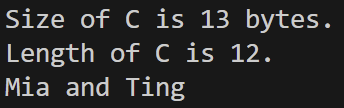

💡 重點筆記：
```c
(1) char C[] = "Mia and Ting"; //會自動在字串末尾加上 '\0'（字串結束符號）。

(2) "Mia and Ting" 共 12 個字元 + '\0' → 共 13 bytes。

(3) sizeof(C) //回傳陣列所佔的總記憶體大小（包含 '\0'）。

此例：13 bytes。

(4) strlen(C) //回傳字串實際字元數量（不含 '\0'）。

此例：12。

(5) printf("%s\n", C); //%s 會從陣列開頭印到 '\0' 為止。
```
---
### 字串與指標
[查看程式碼 ➜](4.characterArraysAndPointers/stringAndPointer.c)

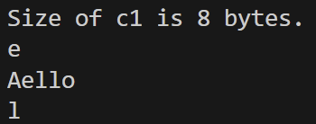

💡 重點筆記：
```c
(1) char C[6] = "Hello"; //建立一個字元陣列（含 '\0'）。

(2) sizeof(c1) //c1 是指標 → 回傳指標大小（64-bit 環境通常為 8 bytes）。

(3) c1 = C;
// C 代表陣列的起始位址（等同 &C[0]）。
// 不能寫 c1 = &C;，因為 &C 型態是 char (*)[6]。

(4) c1[0] = 'A'; // 修改字串第一個字元，結果變為 "Aello"。

(5) *(c1+2) // →  C[2]
// * → 取值 → l。
```

---
### 用字元指標將字串傳入函式
[查看程式碼 ➜](4.characterArraysAndPointers/stringAsFunctionArgument.c)

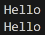

💡 重點筆記：
```c
(1) 陣列傳入函式時會自動轉換成指標：print(C) → print(char *C)。

(2) char *C //會指向傳入陣列的第一個元素 (C[0])。

(3) 透過指標可以直接存取或修改原陣列內容（不需回傳）。

(4) *(C+i) 等同於 C[i]，都是利用指標偏移取得字元。

(5) while(C[i] != '\0')：用 '\0' 判斷字串結尾。
```

## 5. Character Arrays and Pointers Part2
### 記憶體與Stack解析 
[查看程式碼 ➜](4.characterArraysAndPointers/stringAsFunctionArgument.c)

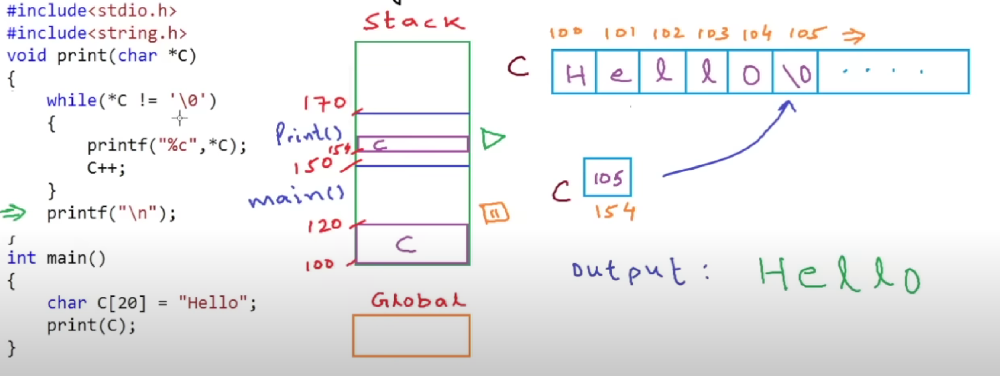

💡 重點筆記
```c
(1) print(C) 
//陣列 C 自動轉換成指向 C[0] 的指標。
//在print()的stack frame 中，建立一個新的指標變數C，此指標指向main的陣列起始位置 100。

(2) 函式結束
//print()結束後，stack中print()的區域變數（包括C這個指標被釋放，但main裡的原本陣列 C[20] 仍存在。
```

---
### 唯讀記憶體 (Read-Only Data Segment)
[詳細筆記 (HackMD)](https://hackmd.io/@SSWinCCUEE/H1NE8wpyK)

[Wikipedia](https://en.wikipedia.org/wiki/Data_segment)

[維基百科](https://zh.wikipedia.org/zh-tw/%E5%94%AF%E8%AE%80%E8%A8%98%E6%86%B6%E9%AB%94)

1️⃣ 程式碼分析
```c
//char C[20] = "Hello"; // 字串被存放在 stack 區域的陣列
char *C = "Hello";      // 字串被存放在 .rodata (唯讀常量區)
C[0] = 'A';             // ❌ 這裡會導致 Segmentation Fault (嘗試修改唯讀記憶體)
```
- `char C[20] = "Hello";` // 配置 20 bytes 的陣列於 stack。

- `char *C = "Hello";` // "Hello" 存放在程式的**唯讀記憶體 (read-only data segment)**。

- `C`是指向常量字串的指標 → 嘗試`C[0] = 'A';`會造成**執行期錯誤 (Segmentation Fault)**。
---
2️⃣ 主要錯誤

你不能修改`char *C = "Hello";`指向的內容，因為這是一個編譯期常量。

正確的作法：
```c
char C[20] = "Hello"; // OK: 可以修改
C[0] = 'A';           // 合法
```
或者如果要使用指標：
```c
const char *C = "Hello"; // 指向常量，不能修改內容
// C[0] = 'A'; // ❌ 編譯錯誤（防止 runtime crash）
```

3️⃣ 💡 重點
```c
(1) 陣列宣告 (char C[]) → 可修改內容 (stack 變數)

(2) 指標指向字串常量 (char *C = "...") → 不可修改內容 (read-only segment)

(3) 嘗試修改字串常量會導致 **Segmentation Fault**。
```
---

## 6. Pointers and 2-D Arrays
### 2D 指標陣列的使用
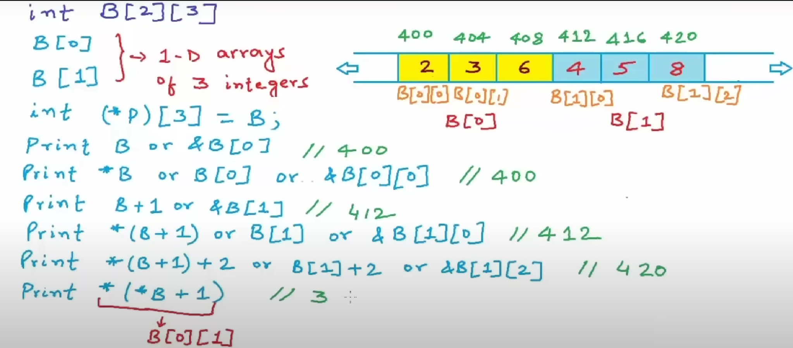

#### 2-D陣列與指標陣列的宣告
```c
int B[2][3];  // 二維陣列，2 列 × 3 欄
int (*p)[3] = B;  // p 是指向含有 3 個 int 的陣列的指標
```
#### 記憶體配置
```c
地址:  400  404  408  412  416  420
值:     2    3    6    4    5    8
       B[0][0] ... B[0][2] B[1][0] ... B[1][2]
```
#### `int (*p)[3]`
```c
(1) p 是一個「指向含有 3 個整數的陣列」的指標。

(2) 因為 B 是 int[2][3]，所以 p 可以直接指向 B。

(3)「其實只用到兩個元素（B[0], B[1]）」是對的，因為這個陣列只有兩列。
```
#### 指標與位址
| 表達式            | 說明                               | 結果 |
|-------------------|------------------------------------|------|
| `B`               | 等同 `&B[0]`，第一列位址           | 400  |
| `*B`              | 等同 `B[0]`，第一列的起始位址      | 400  |
| `B+1`             | 等同 `&B[1]`，第二列位址           | 412  |
| `*(B+1)`          | 等同 `B[1]`，第二列起始位址        | 412  |
| `*(B+1)+2`        | 等同 `&B[1][2]`，第二列第 3 個元素 | 420  |
| `*(*B+1)`         | 取值 → `B[0][1]`                  | 3    |

💡**重點**
```c
(1) B //在大多數運算中會退化為「指向列的指標」。

(2) *B //代表第一列；B+1 代表第二列。

(3) *(*B+1) //是多層解參考，最後取得B[0][1]的值。
```

---
### 二維陣列的存取等價式
```c
B[i][j] = * (B[i] + j)
        = * ( * (B + i) + j )
```
- `B[i]` 代表第 i 列，是指向 int[3] 的指標。

- `B[i] + j` 將指標位移到第 j 個元素。

- 最外層 * 解參考，取得值。
---

## 7. Pointers and Multidimensional Arrays
[查看程式碼 ➜](7.pointersAndMultidimensionalArrays/three-dimensional.c)

1️⃣ 主程式與陣列宣告
```c
// 1D 陣列
int A[3] = {5, 8, 9};

// 2D 陣列
int B[2][4] = {
    {1, 3, 5, 7},
    {2, 4, 6, 8}
};

// 3D 陣列
int C[3][2][2] = {
    {{2, 5}, {7, 9}},
    {{3, 4}, {6, 1}},
    {{0, 8}, {11, 13}}
};
```
💡 思路： (傳入函式時)

- `A` 是一維 → 直接退化成 `int*`

- `B` 是二維 → 會退化成「指向每列（4 個 int）的指標」→ `int (*)[4]`

- `C` 是三維 → 會退化成「指向每個 2x2 block 的指標」→ `int (*)[2][2]`

2️⃣ 位址觀察
```c
printf("%d %d %d %d\n", C, *C, C[0], C[0][0]);
// C         → 第一個 2x2 block 的位址
// *C        → 等同於 C[0]，指向第一個 block 的第一列
// C[0]      → 指向第一列 (int (*)[2])
// C[0][0]   → 第一個元素的位址 (int*)

printf("Value of address(%d) is %d\n", C[0][0] + 1, *(C[0][0] + 1));
// C[0][0] + 1 → 第一個 block 中第 0 列第 1 個元素的位址
// *(C[0][0] + 1) → 取值，等於 C[0][0][1]
```
💡 思路：

- 用這個方式理解為什麼 C 要宣告成 `int (*C)[2][2]`：

  因為「指標位移」必須跨過整個 2x2 block，編譯器需要知道 block 的大小。
---

### 陣列傳入函式的型態規則
- 1D: `int A[3]` → `int *A`
- 2D: `int B[2][4]` → `int (*B)[4]`
- 3D: `int C[3][2][2]` → `int (*C)[2][2]`

### 為什麼？
- 陣列傳入函式時會退化為指標。
- 編譯器必須知道「每列大小」以計算指標位移。
- 若沒有這些資訊，`B+1` 或 `C+1` 會無法正確跨過一整列或一整個 block。

### 記憶體對應
```c
C               // 第一個 block 的位址
*C              // 第一個 block 的第一列
C[0][0]         // 第一個元素
*(C[0][0]+1)    // C[0][0][1]
```
---
### 三維陣列的存取等價式
```c
C[i][j][k] = *(*(C[i]+j)+k)
           = *(*(*(C + i) + j) + k)

```
- `C + i`：指向第 i 個 block

- `*(C+i)`：取出該 block

- `+j`：移動到該 block 的第 j 列

- `+k`：移動到該列的第 k 元素

- `*`：取值
---

## 8. Pointers and Dynamic Memory-Stack vs Heap
### C 函式執行與記憶體配置
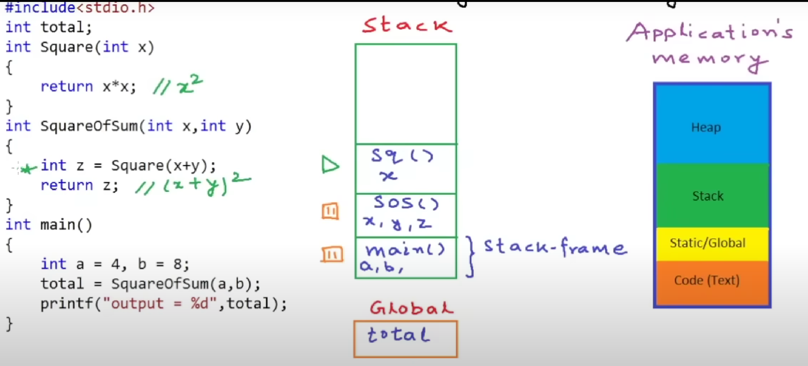

### 📂 記憶體分區（高→低地址）
- `Heap`：動態配置用 malloc
- `Stack`：函式的參數與區域變數
- `Static/Global`：全域變數、static變數
- `Code`：可執行程式碼

### 💡 變數分布位置
| 變數       | 所屬區域     | 位於記憶體哪一區         |
|------------|--------------|---------------------------|
| `total`    | 全域變數     | Static / Global 區        |
| `a, b`     | main 的區域變數 | Stack                    |
| `x, y, z`  | SquareOfSum 的區域變數 | Stack             |
| `x`（12）  | Square 的參數 | Stack（呼叫 Square 時）  |

### 📌 執行流程
1. `main()` 呼叫 `SquareOfSum(a, b)` → 建立新的 Stack frame
2. `SquareOfSum()` 呼叫 `Square(x + y)` → 再建一個 Stack frame
3. 函式結束 → 一層一層釋放 Stack

### 🧠 總結一句話記住：
- `total` 是 資料（變數）→ 放 `Global` 區
- `Square()` 和 `SquareOfSum()` 是 程式碼 → 放 `Text` 區
- 它們和 `main()` 的順序無關，因為「寫在上面 ≠ 放在上面」
---
### Stack Overflow 是什麼？
在 C 語言中，`Stack Overflow（堆疊溢位)` 是指：

>程式使用過多的 stack 記憶體，導致超出系統所配置的限制，進而 程式崩潰或產生未定義行為。

### 📦 Stack 是什麼？
- Stack 是 C 程式中用來儲存：

  - 函式呼叫的參數

  - 區域變數（local variables）

  - 回傳位址（return address）

- 它的記憶體大小是有限的（通常幾 MB 而已）

### ⚠️ 什麼情況會發生 Stack Overflow？
| 情況       | 範例                   | 說明                       |
| -------- | -------------------- | ------------------------ |
| 遞迴呼叫太深   | `func() { func(); }` | 每次呼叫都會占用一個新的 stack frame |
| 區域變數開太大  | `int A[10000000];`   | 區域陣列太大，超過 stack 容量       |
| 多層函式大量呼叫 | 太多函式巢狀，每層都有大量區域變數    | 累積太多 stack frame 導致溢位    |

### 🛠️ 如何避免 Stack Overflow？
- 避免無窮遞迴

- 不要在 Stack 宣告超大陣列（改用 `malloc` 動態配置 → 放在 Heap）

- 遞迴轉迴圈（如 DFS）

### 📌 Stack Overflow vs Heap Overflow？
| 分類   | Stack Overflow | Heap Overflow  |
| ---- | -------------- | -------------- |
| 發生位置 | 函式呼叫堆疊         | 動態配置區域（malloc） |
| 常見原因 | 遞迴太深、變數太大      | 寫入超出配置的記憶體範圍   |
| 解決方式 | 減少遞迴/改 malloc  | 加強邊界檢查         |
---
### Heap 是什麼？ 該如何使用它?
> 在 `C/C++` 程式中，`Heap（堆積區`） 是一塊專門給程式`動態配置記憶體`的空間，也就是我們「需要多少、什麼時候配置、何時釋放」都由程式設計師來決定。

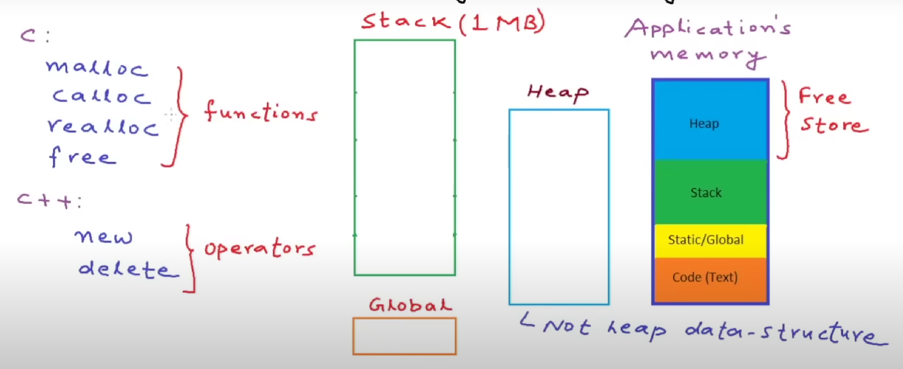

### 🧠 Heap 的基本概念

- Heap 是應用程式的一部分記憶體空間，由作業系統分配，容量大。

- Heap 裡的資料不像 Stack 會自動釋放，必須手動處理。

- 常用於儲存：陣列、結構、鏈結串列等大型或不定大小的資料。

在上圖中，Heap 是記憶體的藍色區塊，位於 Stack 之上，是整體 Application's memory 的一部分。

### 🛠️ C/C++ 中的 Heap 使用方式
| 語言  | 使用方式                                           | 範例                                  |
| --- | ---------------------------------------------- | ----------------------------------- |
| C   | 使用函式 `malloc`、`calloc`、`realloc`、`free` 來操作記憶體 | `int *p = malloc(4 * sizeof(int));` |
| C++ | 使用運算子 `new`、`delete` 來操作記憶體                    | `int *p = new int[4];`              |

這些函式與運算子都會向 Heap 區域申請一塊記憶體。

### 📌 注意事項
- Heap 使用後記得釋放：`free()` (C)、`delete` (C++)。

- 忘記釋放會導致 記憶體洩漏（Memory Leak）。(後面會提到!)

- Stack 是系統自動管理；Heap 是由你來管理！
---
 ### malloc 的記憶體配置動態與圖解
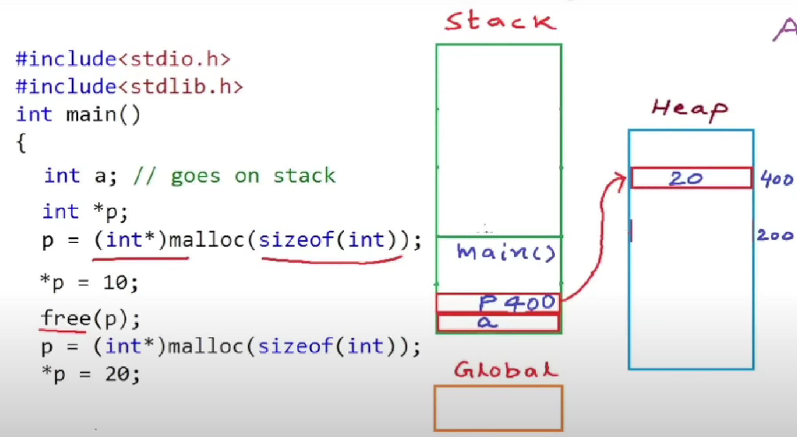

### 🧠 記憶體區域解析
### 程式一開始的配置
| 記憶體區域     | 描述                             |
| --------- | ------------------------------ |
| Stack（堆疊） | 儲存區域變數 `a` 和指標 `p`（此時 p 尚未初始化） |
| Heap（堆積）  | 還沒有配置                          |

### 第一次 malloc 執行時
```c
p = (int*)malloc(sizeof(int));
```
- `p` 取得 heap 中一塊 4 bytes 記憶體的地址（假設為 `200`）

- `*p = 10`; 將值 10 寫入 heap 的這塊記憶體

🧠 記憶體此時長這樣：

- Stack:

  - `a`：未知值

  - `p`：儲存 `200`

- Heap:

  - `200`：值為 `10`

### 接下來執行 free(p);
- heap 上 `200` 的空間被釋放

- ❗ 注意：雖然空間釋放了，但 `p`的值（仍是 `200`）沒被自動清除！

### 第二次 malloc：
```c
p = (int*)malloc(sizeof(int));
*p = 20;
```
- 系統重新配置了一塊 heap 記憶體（這次是 `400`）

- 把值 20 存進 `*p`

🧠 記憶體現在長這樣：

- Stack:

  - `a`：未知

  - `p`：儲存 `400`

- Heap:

  - `400`：值變為 20

### ✅ 小結
| 時間點        | Stack 記憶體            | Heap 記憶體       |
| ---------- | -------------------- | -------------- |
| 初始化        | `a` 和 `p` 尚未賦值       | 無配置            |
| 第一次 malloc | `p` → 指向 `200`     | `200` = `10` |
| free(p)    | `p` 保留，但 `200` 被釋放 | 空間變成可再利用       |
| 第二次 malloc | `p` 指向 `400`      | `400` = `20` |
---
## 9. Dynamic Memory Allocation in C-malloc calloc realloc free
## malloc (Memory Allocation)
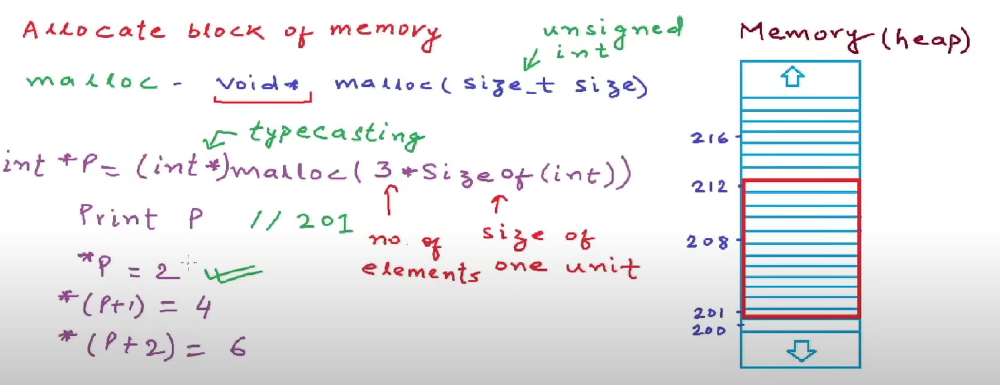

```c
void* malloc(size_t size);
```

### ☑️ 參數說明：

* `size` → 總共要配置的記憶體大小（位元組）

### ☑️ 功能：

* 配置一塊記憶體空間
* **內容不初始化（為垃圾值）**
* 回傳 `void*` 指標，需轉型 ex:`(int *)`、`(char *)`

### ☑️ 範例：

```c
int *p = (int *)malloc(3 * sizeof(int));
```

### ☑️ 回收空間：

```c
free(p);
```

---
## calloc (Contiguous Allocation)
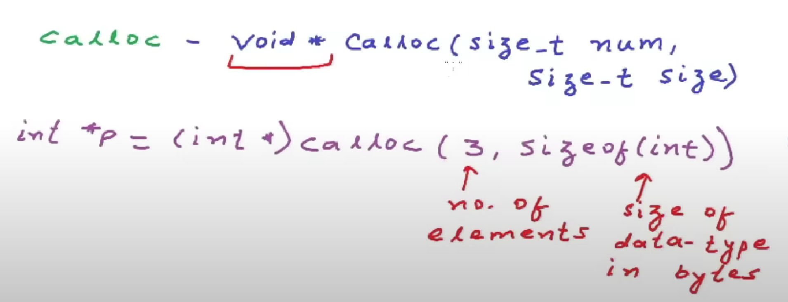

```c
void* calloc(size_t num, size_t size);
```

### ☑️ 參數說明：

* `num` → 要配置的元素個數（number of elements）
* `size` → 每個元素的大小（使用 `sizeof(type)`）

### ☑️ 功能：

* 配置一塊連續記憶體空間
* **內容自動初始化為 0**
* 回傳 `void*` 指標，需轉型 ex:`(int *)`、`(char *)`

### ☑️ 範例：

```c
int *p = (int *)calloc(3, sizeof(int));
```
---
## realloc (Reallocate Memory)
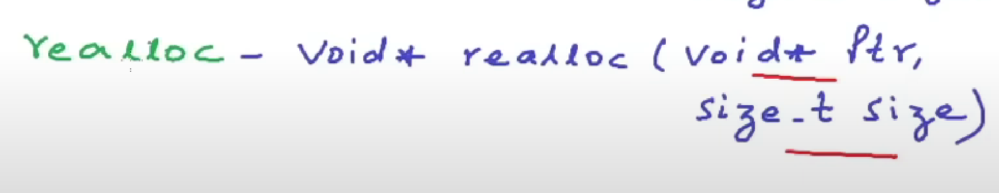

```c
void* realloc(void* ptr, size_t new_size);
```

### ☑️ 參數說明：

* `ptr` → 原本的記憶體指標（可為 NULL）
* `new_size` → 新的記憶體大小（位元組）

### ☑️ 功能：

* 調整已配置記憶體區塊的大小：

  * 增加：可能搬移位置（內容會保留）
  * 減少：前段保留，後段釋放
* `ptr == NULL` → 等同 malloc
* `new_size == 0` → 等同 free

### ☑️ 範例：

```c
int *p = (int *)malloc(3 * sizeof(int));
p = (int *)realloc(p, 5 * sizeof(int));
```

---

## 4. 總結

| 函式        | 自動初始化 | 可調整大小 | 備註         |
| --------- | ----- | ----- | ---------- |
| `malloc`  | ❌ 否   | ❌ 否   | 需自行初始化     |
| `calloc`  | ✅ 是   | ❌ 否   | 初始化為 0     |
| `realloc` | ❌ 否   | ✅ 是   | 調整大小並保留原資料 |

---

## 10. Pointers as Function Returns in C/C++
### 使用 malloc 與 free 後的指標行為說明
[查看程式碼 ➜](10.Pointers%20as%20Function%20Returns%20in%20C/malloc-free.c)

### 🔍 為什麼 A[2] = 6 還能動作？
| 名稱        | 說明                                        |
| --------- | ----------------------------------------- |
| `free(A)` | 釋放的是 **Heap** 中 `A` 所指向的記憶體，不會改變 `A` 自身的值 |
| `A`       | `A` 本身是在 **Stack** 裡的變數，仍然記得原本的位址         |
| 結果        | 如果記憶體尚未被重用，還能「看到」原本的資料，但這是**未定義行為（UB）**   |

---

### ⚠️ 為什麼這樣危險？
- 使用 `free()` 後的記憶體稱為 dangling pointer（懸空指標）

- 雖然你仍能訪問那塊記憶體，但：

  - 作業系統有權重新配置那段空間

  - 寫入資料會導致資料毀損、崩潰或難以 debug 的 bug

  - 不同平台、編譯器結果會不一樣（不是 deterministic 行為）

---
### ✅ 安全做法
```c
free(A);
A = NULL;  // ✅ 清除指標，防止誤用
```
這樣做的好處：

- 再次使用 A 時會馬上觸發錯誤（NULL dereference），方便排除問題

- 避免指向未知區域導致資料毀損

### 📌 小結
| 動作           | 說明                          |
| ------------ | --------------------------- |
| `malloc()`   | 配置記憶體於 Heap，指標儲存在 Stack     |
| `free(ptr)`  | 回收 Heap 空間，但不改變指標 `ptr` 的值  |
| `ptr = NULL` | ⭐ 安全習慣！阻止後續對無效記憶體的訪問        |
| 存取已釋放記憶體     | ❌ 未定義行為，可能 crash、可能成功、可能毀資料 |
---
### 使用 realloc 調整記憶體大小的行為說明
[查看程式碼 ➜](10.Pointers%20as%20Function%20Returns%20in%20C/reallocUsage.c)

---
### 常見操作：

- 放大：`int* B = realloc(A, 2 * n * sizeof *A);`

- 縮小：`int* B = realloc(A, (n / 2) * sizeof *A);`
---
### 原理說明：

- 若**原位置後方空間足夠** → 嘗試**原地調整**（`B` 可能等於 `A`）。

- 若**不夠** → 於 Heap **配置新區塊、複製舊資料、釋放舊區塊**（`B` 與 `A` 可能不同）。

- **成功後**：只能用新指標（`B`），舊指標（`A`）視為失效。

- **縮小後**：只保留前 `new_size bytes` 的內容；擴大後新增區域內容**未初始化**。
---
### 🔁 特殊情況
- `realloc(ptr, 0)` → 等同 `free(ptr)`

- `realloc(NULL, size)` → 等同 `malloc(size)`
- 實例:
```c
B = realloc(A, 0);             // 等同 free(A)
int *B = realloc(NULL, n * sizeof(int)); // 等同 malloc
```
---
### ⚠️ 安全性（務必遵守）
- **不要**直接寫 `A = realloc(A, new_size);`
失敗會回傳 `NULL`，導致原位址遺失（記憶體洩漏）。

- 推薦寫法：
```c
int* tmp = realloc(A, new_size);
if (tmp != NULL) {
    A = tmp;   // 只在成功時更新
} else {
    // A 仍然有效；在這裡決定是否 free(A) 或其他處理
}
```
- 縮小後**不要**讀取超過新範圍；擴大後請**先初始化**新增區域。

- 需要比對位址時，用 `%p` 印指標本身（`A/B`），不是 `&A/&B`。
---
### 📌 realloc 成功 / 失敗與指標有效性對照表
| 狀況           | `B`（回傳值）           | `A`（舊指標）     | 資料狀態       |
| ------------ | ------------------ | ------------ | ---------- |
| **成功（原地擴縮）** | 非 `NULL`，且與 `A` 相同 | 同 `B`        | 資料保留       |
| **成功（搬家）**   | 非 `NULL`，與 `A` 不同  | ❌ 不可再用（已被釋放） | 資料已複製到 `B` |
| **失敗**       | `NULL`             | ✅ 仍有效（原資料還在） | 無變化        |
---
### Heap 與 Stack 回傳指標的差異
[查看程式碼 ➜](10.Pointers%20as%20Function%20Returns%20in%20C/pointerAsFunctionReturns.c)

### 1️⃣ main 的區域變數與呼叫通訊
```c
int a = 2, b = 4;
ptr = addByPointer(&a, &b);
```
- `a`、`b` 都在 **main** 的 **Stack frame** 裡。

- 我們把兩個變數的位址傳進 `addByPointer`。
---
### 2️⃣ 在函式中使用 malloc
```c
int *c = (int*)malloc(sizeof(int));
*c = (*a) + (*b);
return c;
```
- `c` 指向 **Heap** 裡新配置的一格整數空間。

- 資料寫進 Heap 中，即使函式結束，**記憶體仍然有效**。

- 回傳的是 **Heap 地址**，不是區域變數地址。
---
### 3️⃣ 如果改成 Stack 區域變數會發生什麼？
```c
int c = (*a) + (*b);
return &c;   // ❌ 危險：c 在函式內的 Stack
```
- 函式結束時，`c` 所在的 **Stack frame** 會被標記為可用。

- 後續任何呼叫（例如又呼叫另一個函式）都可能覆蓋它。

- 沒被覆蓋時「看似可用」，但不穩定。
---
### 4️⃣ 假設情境 — Stack 被覆蓋
- **情境 A（運氣好）**
呼叫 `addInStack()` 後立刻用回傳指標去取值 → Stack 那塊還沒被覆寫 → 你看到對的值。

- **情境 B（危險）**
呼叫 `addInStack()` 後再呼叫其他函式（例如 `printHelloWorld()`）→ 新的 Stack frame 覆蓋原位置 → 值亂掉或程式崩潰。

---
### 5️⃣ 為什麼 Heap 安全
- Heap 空間不會因為函式結束自動釋放。

- 除非手動 `free()`，否則內容不會被新函式覆蓋。

- 適合用在需要函式外繼續使用資料的情況。
---

## 11. Function Pointers in C / C++
### function pointer原理解釋
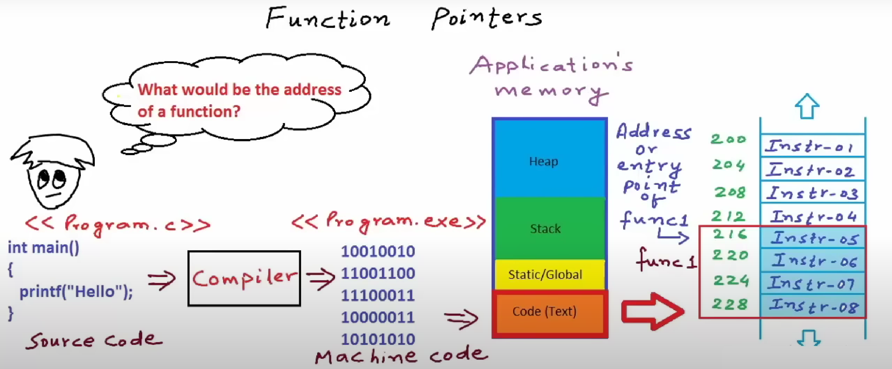

#### (1) 問題起源
在 C 語言中，我們可以使用「函式指標（Function Pointer）」來儲存並呼叫函式。  
這時就會有一個問題：
> **函式的位址到底是什麼？**

---

#### (2) 從程式碼到記憶體

##### 2.1 範例程式
```c
int main() {
    printf("Hello");
}
```
這是**Source Code（原始碼**，需要透過**編譯器(Compiler)**轉換成 CPU 能讀懂的**Machine Code（機器碼）**。

---
##### 2.2 編譯後的變化
編譯器會將程式碼轉換成二進位機器碼，例如：
```c
10010010
11001100
11100011
10000011
10101010
```
在 Windows 上可能生成`program.exe`這樣的執行檔。

---
#### (3) 應用程式的記憶體結構
當程式被載入到記憶體中，會有幾個主要區段：
| 區段名稱          | 用途                        |
| ------------- | ------------------------- |
| Heap          | 動態記憶體配置（`malloc` / `new`） |
| Stack         | 區域變數、函式呼叫紀錄（stack frames） |
| Static/Global | 全域變數與靜態變數                 |
| Code (Text)   | 程式的機器碼（指令），包含所有函式的實作      |
---
#### (4) Function 與 Instruction 的關係
- **Function（函式）**：一段有名字的程式碼，完成特定任務。

- **Instruction（指令）**：CPU 可以直接執行的最小命令（如資料載入、加法、跳躍、呼叫函式）。

當我們寫一個函式，例如：
```c
void func1() {
    // ...
}
```
編譯器會將它轉成多條連續的指令（instructions），並放在**Code/Text區段**。
假設`func1()`編譯後如下：
| 位址  | 指令名稱     |
| --- | -------- |
| 216 | Instr-05 |
| 220 | Instr-06 |
| 224 | Instr-07 |
| 228 | Instr-08 |

📌 **重點**：

- 函式的「位址」= 該函式**第一條指令**的記憶體位址（這裡是 216）。

- 呼叫函式時，CPU 會從這個位址開始，依序執行該函式的所有指令直到結束。
---
#### (5) 函式指標的運作方式
我們可以宣告一個函式指標指向`func1`：
```c
void (*fp)() = func1;
```
🔍 語法拆解說明
| 部分        | 代表意義                                                                                                        |
| -------------- | ----------------------------------------------------------------------------------------------------------- |
| `void`    | **函式的回傳型別** — 這個指標指向的函式必須回傳 `void`（不回傳任何值）。這裡用 `void` 只是範例，你也可以改成 `int`、`float`、或任何指標型別，例如 `char*`，視函式需要而定。 |
| `(*fp)`   | **指標變數名稱** — `fp` 是指標變數，`*` 表示它儲存的是一個**位址**（函式的起始位址(第一條指令的位址)）。括號不可省略，否則會被誤解成「回傳函式指標的函式」。                             |
| `()`      | **參數型別列表** — 空括號表示該函式不接受任何參數。如果需要參數，應在括號內指定型別，例如 `(int, char*)`。                                            |
|    `= func1`    | **賦值動作** — 將 `func1` 函式的位址（第一條指令所在的記憶體位址，例如 216）存入 `fp`。`func1` 與 `&func1` 在此等價。                            |

💡 呼叫`fp()`等同於呼叫`func1()`，CPU 會從該位址開始依序執行`func1`的指令。

---
#### (6) 為什麼要知道這些？
理解函式位址與指令的關係，可以幫助你：

- 使用**callback（回呼函式）**。

- 在函式表（function table）中儲存不同的功能，動態選擇執行。

- 進一步學習系統層與嵌入式開發中函式指標的應用。
---
📝 **總結**
- **函式位址** = 第一條指令的位址。

- **Instruction**是 CPU 執行的最小單位，函式是多條指令的集合。

- 函式指標實際上儲存的是「函式的起始位址」。
---
### function pointer實例操作
[查看程式碼 ➜](11.functionPointersInC/functionPointer.c)
#### (1)宣告函式
```c
int Add(int a, int b) {
    return a + b;
}

void PrintHello(char* name) {
    printf("Hello %s\n", name);
}
```
- `Add`：接收兩個`int`參數，回傳它們的和。

- `PrintHello`：接收一個字串（`char*`），輸出問候語。
---
#### (2)宣告函式指標
```c
int (*p)(int, int);
void (*ptr)(char*);
```
- `p`：指向回傳**int、參數型別為**`(int, int)`的函式。

- `ptr`：指向**回傳 void、參數型別為**`(char*)`的函式。

💡 **語法提醒**：

- 小括號 `()` 在 `*p` 外面很重要，否則會變成宣告「回傳函式指標的函式」。
```c
int (*p)(int, int)    // p 是函式指標
int *p(int, int)      // p 是回傳 int* 的函式
```
---

#### (3)函式指標的賦值
```c
p = &Add;   // 或 p = Add; 都可以
ptr = PrintHello;
```
- `Add`和`&Add`的值是一樣的：**函式的起始位址**（第一條指令的位置）。

- 將這個位址存進函式指標後，就可以透過指標呼叫它。
---

#### (4)透過指標呼叫函式
```c
int sum = p(3, 5);  // 呼叫 Add(3,5)
printf("%d\n", sum);

ptr("Mia");         // 呼叫 PrintHello("Mia")
```
- 呼叫語法和直接呼叫函式一樣，不需特別寫 `(*p)(...)`，但 `(*p)(...)` 也是合法寫法。

- CPU 在執行時，會依照指標儲存的位址跳到該函式的機器碼起始位置，執行函式內容。
---

🎯 **這段程式的用意**
**1. 示範如何宣告函式指標**，包含有回傳值與無回傳值的情況。

**2. 理解函式位址的本質**：函式名稱其實就是一個指向該函式起始位址的常數。

**3. 展示函式指標的應用**：可將函式位址儲存到變數中，再動態呼叫，常用於：

  - **Callback（回呼函式）**

  - **事件處理（event handling）**

  - **函式表（function table）與動態分派**
---
## 12. Function Pointers and Callbacks
### function pointer 基本範例
[查看程式碼 ➜](12.functionPointersAndCallbacks/callback-example.c)

---

### 📝 重要觀念

#### Callback Function（回呼函式）
- **定義**：一個函式的指標被當作參數傳給另一個函式，並在該函式中被呼叫。

- 在此範例中：

  - `A()`是被呼叫的函式。

  - 當`A`的位址被傳給`B`並在`B`內執行時，`A`才扮演 callback function。
---
#### Function Pointer（函式指標）
- 定義：儲存函式位址的指標。

- 語法：
```c
返回型態 (*指標名稱)(參數型態列表)
```

- 此範例：
```c
void (*p)() = A;
```
表示`p`是一個指向「**回傳 void 且無參數**」函式的指標。

---
#### B(p) 等同於 B(A)
- 在 C 語言中，函式名（如`A`）不加括號時會**自動轉換成指向該函式的指標**。

- 因此：
```c
B(p);  // 使用函式指標呼叫
B(A);  // 直接傳函式名，效果相同
```
---
### 🔍記憶體結構示意圖
```c
+----------------------+       +-------------------+
| main() Stack Frame   |       | 程式碼區 (Text)   |
|----------------------|       |-------------------|
| p ───────────────┐   |       | A(): Hello\n ...  |
+------------------|---+       +-------------------+
                   ▼
           [A 的起始位址]

```
- `p`儲存的是`A`函式的起始位址（第一條指令的位置）。

- 在`B`中，`ptr`也是一個函式指標，呼叫`ptr()`就等於執行`A()`。
---

### BubbleSort by Callback
[查看程式碼 ➜](12.functionPointersAndCallbacks/bubblesortByCallback.c)

## 範例程式碼
```c
#include<stdio.h>

int compare(int first,int second){
    if(first>second) return 1;
    else return -1; // 可以更改回傳值邏輯來決定升冪或降冪
}

void BubbleSort(int *A,int size,int (*compare)(int,int)){ // 參數接收 callback function
    int i,j,temp;
    for(i=0;i<size-1;i++){
        for(j=0;j<size-1-i;j++){
            if( (compare(A[j],A[j+1]) > 0) ){
                temp=A[j];
                A[j]=A[j+1];
                A[j+1]=temp;
            }
        }
    }
}

int main(){
    int A[]={3,2,1,5,6,4};
   
    BubbleSort(A,6,compare); // 傳入函式指標（callback function）
    for(int i=0;i<6;i++) printf("%d ",A[i]);

    return 0;
}
```
#### Callback Function 是什麼？
- **定義**：將一個函式的位址（函式指標）作為參數傳給另一個函式，並由該函式在適當時機呼叫它。

- 在本例中：

  - `compare`是被傳入`BubbleSort`的**callback function**。

  - `BubbleSort`透過`compare(A[j], A[j+1])`呼叫這個外部邏輯來判斷排序順序。

---
#### 為什麼不直接在 `BubbleSort` 內呼叫 `compare()`？
**直接呼叫版本**
```c
void BubbleSort(int *A,int size) {
    for (...) {
        if (compare(A[j], A[j+1]) > 0) {
            // swap
        }
    }
}
```
✅ 可行，但：

- 綁死只能使用這個 `compare`。

- 要改成降冪排序必須修改 `BubbleSort` 內部程式碼並重新編譯。

- 無法在同一次執行中選擇不同排序規則。

**傳 callback 版本**
```c
void BubbleSort(int *A,int size,int (*compare)(int,int)) { ... }
```
✅ 好處：
- **解耦**：排序演算法與比較邏輯分開。

- **可重用**：同一份排序程式可以支援多種排序規則。

- **靈活性**：可以在 runtime 依情況決定比較邏輯（升冪、降冪、自訂規則）。
---
#### 3️⃣ 語法重點
**1.函式指標的宣告**
```c
int (*compare)(int,int)
```
- 外層括號不可省略，否則會變成 `int *compare(int,int)`（代表回傳 int* 的函式）。

- 函式格式必須與實際傳入的函式完全一致。

**2.函式名會退化為指標**

- 在 `main` 中 `compare`（不加 `()`）會自動轉成指向該函式的位址。

- 所以 `BubbleSort(A, 6, compare)` 與 `BubbleSort(A, 6, &compare)` 等價。

**3.呼叫函式指標**
- 可用 `compare(x, y)` 或 `(*compare)(x, y)`，兩者等價。

---
#### 4️⃣ 常見錯誤與避免方法
| 錯誤類型      | 錯誤範例                          | 為什麼錯                  | 正確寫法                        |
| --------- | ----------------------------- | --------------------- | --------------------------- |
| 宣告括號錯誤    | `int *compare(int,int)`       | 變成「回傳 int\* 的函式」      | `int (*compare)(int,int)`   |
| 呼叫時加 `()` | `BubbleSort(A, 6, compare())` | 這會先執行函式並傳回 int，不是函式位址 | `BubbleSort(A, 6, compare)` |
| 括號優先順序錯   | `compare(A[j], A[j+1] > 0)`   | 會先計算布林值再傳入            | `compare(A[j], A[j+1]) > 0` |
| 參數型態不符    | `void (*compare)(int,int)`    | 函式格式不同可能編譯錯誤或未定義行為      | 型態必須一致                      |
| 沒處理相等     | 永遠回 1 或 -1                    | 導致排序不穩定               | 相等時回 0                      |
---
#### 5️⃣ 範例：切換排序方式
```c
int ascending(int a, int b) {
    return a - b; // 升冪
}

int descending(int a, int b) {
    return b - a; // 降冪
}

BubbleSort(A, n, ascending);
BubbleSort(A, n, descending);
```
- 只換傳入的 callback function，`BubbleSort` 本身不用改任何程式碼。
---
#### 6️⃣ 執行流程圖
```c
main()
   │
   ├─ 呼叫 BubbleSort(A, 6, compare)
   │               │
   │               ▼
   │         BubbleSort 收到 compare 的位址
   │               │
   │         迴圈中呼叫 compare(A[j],A[j+1])
   │               │
   ▼               ▼
 compare() 根據邏輯回傳 1/-1/0
   │
   └─ 回到 BubbleSort 判斷是否交換元素
```
---
##### ️總結
- 直接 `call compare()` → 簡單，但耦合度高、彈性差。

- **透過參數傳 callback** → 多一個參數，但可重用性高、可動態更換邏輯。

- 如果排序邏輯固定且不會變，可直接 call；
如果需要通用化或支援多種排序規則，建議使用 callback function。

---

### 延伸應用：多種排序邏輯

上面範例中，我們只用一個 `compare` 函式實現單一的比較規則（升冪）。  
但如果需求增加，例如要支援 **升冪 / 降冪**、**正常值 / 絕對值** 四種不同模式，  
就可以定義多個比較函式，並在 `main` 中根據使用者選擇傳入對應的函式指標。

這樣可以：
- 保持 `BubbleSort` 核心程式碼不變
- 在執行時自由切換排序邏輯
- 讓排序函式更加通用化，甚至可以擴展到其他型態（如字串、結構）

接下來的範例將示範如何將 **正常/絕對值** 與 **升冪/降冪** 結合，讓使用者一次可選擇四種排列方式。

---
#### 範例程式碼：四種排序模式

[查看程式碼 ➜](12.functionPointersAndCallbacks/absSortByCallback.c)

**程式說明**
- **多個比較函式**：

  - 每個函式都遵循相同函式格式 `int (int, int)`，方便傳給 `BubbleSort`。

  - 正常值 / 絕對值 + 升冪 / 降冪 形成四種組合。

- **函式指標選擇**：

  - 使用 `switch` 依使用者輸入，選擇對應的比較函式傳給 `BubbleSort`。

- **排序核心不變**：

  - `BubbleSort` 不需知道是什麼排序規則，透過 callback 動態呼叫比較邏輯。
---
**延伸討論：為什麼不用 if 寫死？**
如果用 `if` 或直接在 `BubbleSort` 裡寫 `A[j] > A[j+1]`，

- 只能支援固定的比較方式

- 要增加排序模式必須改 `BubbleSort` 本身，違反「模組化設計」原則

- 無法在執行時決定排序規則

透過 **Callback Function**：

- 不必改排序函式，新增比較模式只需寫新函式

- 可以在 runtime 選擇排序方式

- 讓演算法與比較邏輯解耦，增加可重用性與可維護性
---
### QuickSort by Callback
#### 範例程式碼 

[查看程式碼 ➜](12.functionPointersAndCallbacks/qsortByCallback.c)

#### 1️⃣ 這段程式的目的是什麼？
它的功能是 用 **C 標準函式庫的 `qsort()`** 來排序一個整數陣列
在這裡，陣列是：
```c
{-31, 22, -1, 50, -6, 4}
```
排序後會變成：
```c
-31 -6 -1 4 22 50
```
---
#### 2️⃣ qsort 是什麼？ 

- **定義**：`qsort`（Quick Sort）是 C 標準函式庫 `<stdlib.h>` 提供的泛型排序函式。

- **好處**：可以排序任何型態的資料（整數、浮點數、字串、結構），不需要自己寫排序演算法。

- **函式原型**：
```c
void qsort(
    void *base,              // 要排序的陣列起始位址
    size_t nitems,           // 陣列元素數量
    size_t size,             // 每個元素大小（位元組）
    int (*compare)(const void *, const void *) // 比較函式
);
```

## 相關參考資源
- [Microsoft Docs - qsort 函式說明](https://learn.microsoft.com/zh-tw/cpp/c-runtime-library/reference/qsort?view=msvc-170)  
- [HackMD - C 語言 qsort 筆記](https://hackmd.io/@hank20010209/S1mOTzbys/%2Fe8GFgX6nSIetgJcTZy_jrQ)  
- [TutorialsPoint - C qsort 函式](https://www.tutorialspoint.com/c_standard_library/c_function_qsort.htm)

---
#### 3️⃣ compare 函式
```c
int compare(const void* a, const void* b){
    int A = *((int*)a); // 把 void* 轉成 int* 再取值
    int B = *((int*)b);

    return A - B; // 升冪排序：A > B 回正數，A < B 回負數
}
```
- 因為 `qsort` 是**泛型**，不知道你要排的是什麼型態，所以會把元素指標傳進來，型態是 `const void*`（泛型指標）。
  - 因為它不知道你陣列裡的元素型態，所以它只能用「泛型指標」void* 來接收元素地址。

  - `const` 是保護作用，表示 `qsort` 在比較時不會修改元素內容。

  - 💡 重點：

  - `const void*` 只是一個「**不知道裡面是什麼型態的地址**」。

  - 要用它，必須自己轉回正確型態。

- 在比較函式裡，我們必須自己把它轉回正確型態（這裡是 `int*`）。

#### 圖解記憶
假設第一次呼叫：
```c
a → &A[0]   (位址)
b → &A[1]   (位址)

(int*)a  → 把泛型指標轉成 int 指標
*((int*)a) → 取出該位置的整數值
```
#### 4️⃣ main() 的流程
```c
int A[]={-31,22,-1,50,-6,4};

// 用 qsort 排序
qsort(
    A,                // 陣列起始位址
    6,                // 陣列長度
    sizeof(int),      // 每個元素的大小
    compare           // 比較函式
);

// 印出結果
for(int i=0;i<6;i++)
    printf("%d ",A[i]);
```
- `qsort` 會根據 `compare` 函式的邏輯進行排序

- 執行後陣列 `A` 已經被排序好

- 最後用迴圈輸出排序後的結果

### ✅ 重點：

- `qsort` 是 C 語言內建的泛型排序工具

- 你要**自己寫比較函式**，告訴 `qsort` 什麼順序算「大於 / 小於」

- 比較函式必須用 `const void*` 當參數，並在裡面轉型

---
## 13. Memory Leak in C/C++
### C：Stack vs Heap（以洗牌小遊戲為例）
> 本筆記示範同一支程式，將字元陣列放在**Stack（Case 1）** 與 **Heap（Case 2）** 之差異、效能與風險。最後附上記憶體配置圖。

[查看程式碼 ➜](13.memoryLeak/find.c)

---

### Case 1 與 Case 2 的主要差別
| 項目   | **Case 1（Stack 陣列）**         | **Case 2（Heap 陣列）**                  |
| ---- | ---------------------------- | ------------------------------------ |
| 配置位置 | 在函式 `Play()` 的 Stack frame 內 | 在 Heap 中                             |
| 生命週期 | 函式結束 → Stack frame 自動釋放      | 函式結束 → Heap 記憶體**不會自動釋放**（若未 `free`） |
| 效能   | 配置/釋放速度快                     | 配置成本高                                |
| 風險   | 無記憶體洩漏風險（但可能溢位）              | 忘記 `free` 會造成記憶體洩漏                   |

---
### 記憶體配置與生命週期示意圖
應用程式記憶體空間
```c
 ┌──────────────────────────────┐
 │   Code Segment (程式碼區)     │
 ├──────────────────────────────┤
 │   Global / Static (全域變數)  │
 │   cash = 100                  │
 ├──────────────────────────────┤
 │   Heap  ← 向上成長             │
 │   [Case 2 的陣列資料] ◄──────────────┐  函式結束後仍存在
 │                               │        （若沒 free）
 │                               │
 ├──────────────────────────────┤       
 │   Stack ← 向下成長             │       
 │ ┌───────────────────────────┐ │       
 │ │ Play() 的 Stack frame     │ │       
 │ │   - 變數 i, guess, temp   │ │       
 │ │   - [Case 1 的陣列資料]◄──┘ │       
 │ └───────────────────────────┘│       
 │ ↑ 函式結束 → frame 自動回收    │
 │   C 陣列資料隨之消失           │
 └──────────────────────────────┘
```
---
### 備註：`rand()` 與 `% 3` 的意義
#### 1. `rand()`

- 標準 C 函式庫的隨機數生成器，回傳一個介於 `0`與 `RAND_MAX` 之間的整數。

- 通常搭配 `srand(seed)` 設定種子，否則每次執行都會產生相同序列。

#### 2. `rand() % 3`

  - 取 `rand()` 的結果對 3 取餘數，得到 `0, 1, 2` 三種結果之一。

  - 在這裡用來隨機選擇三張牌中的兩張，做交換動作。
---
### 如何在 Windows 工作管理員觀察記憶體變化
#### 1️⃣ 開啟工作管理員
- 按下 `Ctrl + Shift + Esc`（最快捷鍵）

- 或 `Ctrl + Alt + Delete` → 選擇**工作管理員**

- 或在工作列右鍵 → **工作管理員**

#### 2️⃣ 切換到「詳細資料」分頁
- 找到你的程式，例如：

  - 如果直接編譯成 `a.exe` → 找 `a.exe`

  - 如果從 VSCode / IDE 執行 → 可能顯示為 `code.exe` 下的子行程

#### 3️⃣ 顯示更精確的記憶體欄位
1. 在標題列右鍵 → 選擇欄位

2. 勾選：

  - **工作集（Working Set）** → 目前在 **RAM** 中的實體記憶體

  - **提交大小（Commit size / Private bytes）** → 向系統保留的虛擬記憶體大小（觀察 Memory Leak 時更準確）

#### 4️⃣ 觀察兩種情況
**Case 1（Stack 陣列)**
- 執行遊戲程式後，**工作集**與**提交大小**幾乎不變

- 因為 Stack frame 每次函式結束後自動釋放

- 記憶體佔用會保持穩定，不會越跑越高

**Case 2（Heap 陣列，且未 `free`）**
- 每次 Play() 都`malloc(10000)`，不釋放

-  **提交大小（Commit size**會持續上升，因為 Heap 配置的記憶體一直累積

- **工作集（Working Set**也可能慢慢變大（但有時會被 OS 壓縮/修剪，變化不一定平滑）

- 如果把 `malloc` 的大小改成**10MB**或更多，變化會更明顯（方便教學觀察）
---
**✅ 這樣就能用工作管理員直觀驗證**：

- **Stack** 變數結束後會自動釋放

- **Heap**記憶體若沒`free`就會一直佔用

---
**📌 總結**
**Memory Leak** 是指程式在 Heap 中配置了記憶體，卻在不再使用時沒有釋放，導致記憶體資源無法回收、佔用持續增加。
因此，凡是使用 `malloc`（或其他動態配置函式）取得的記憶體，都應在使用完畢後呼叫 `free` 來釋放，避免記憶體洩漏。


